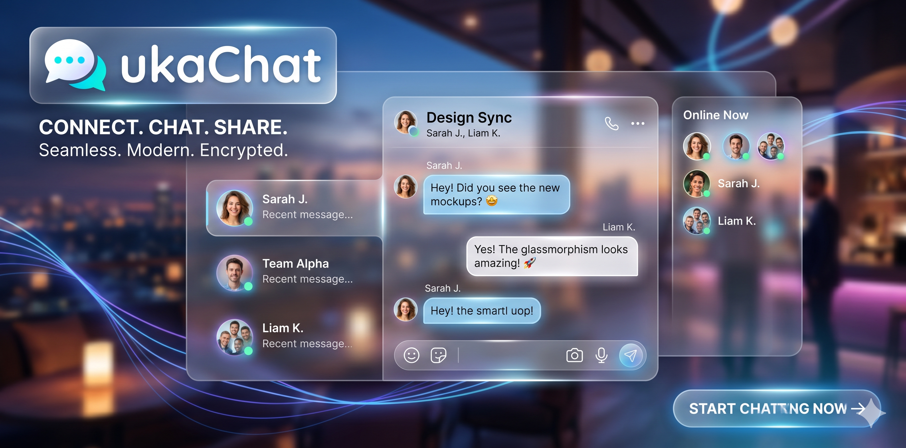
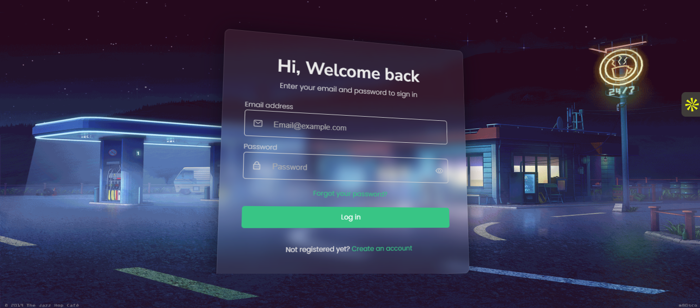
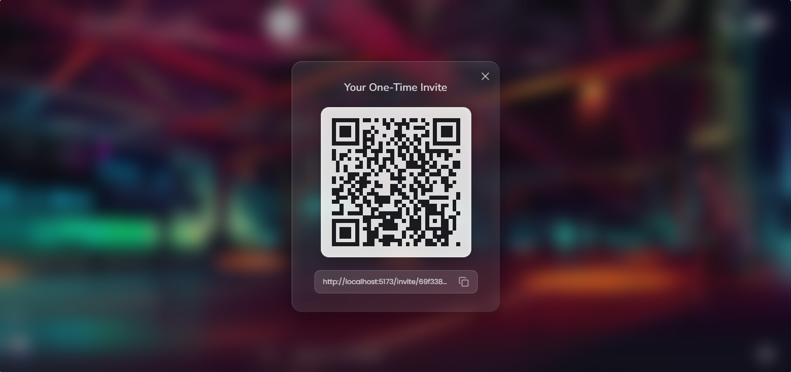
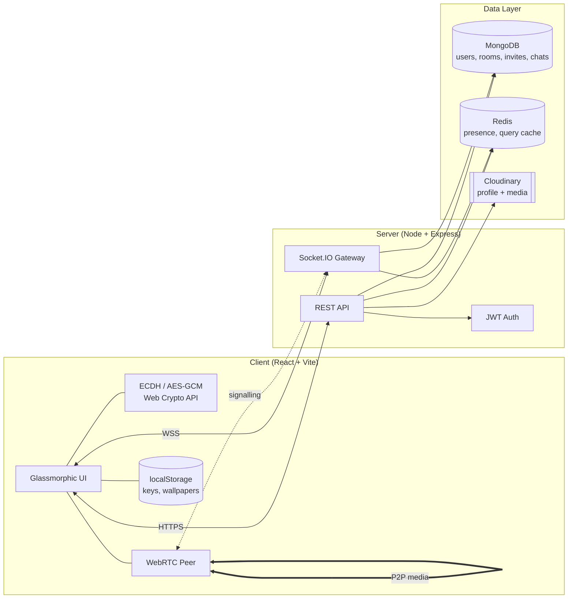
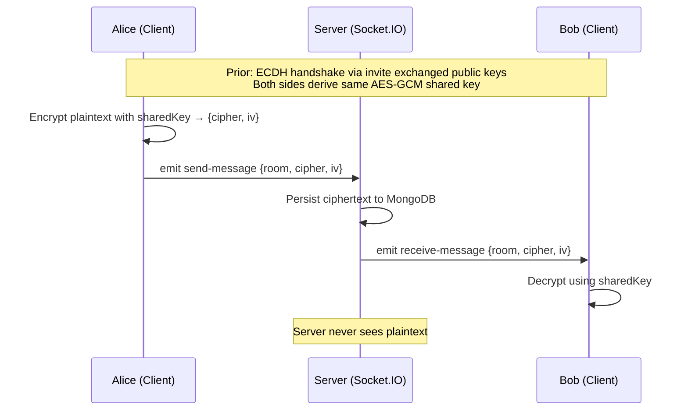
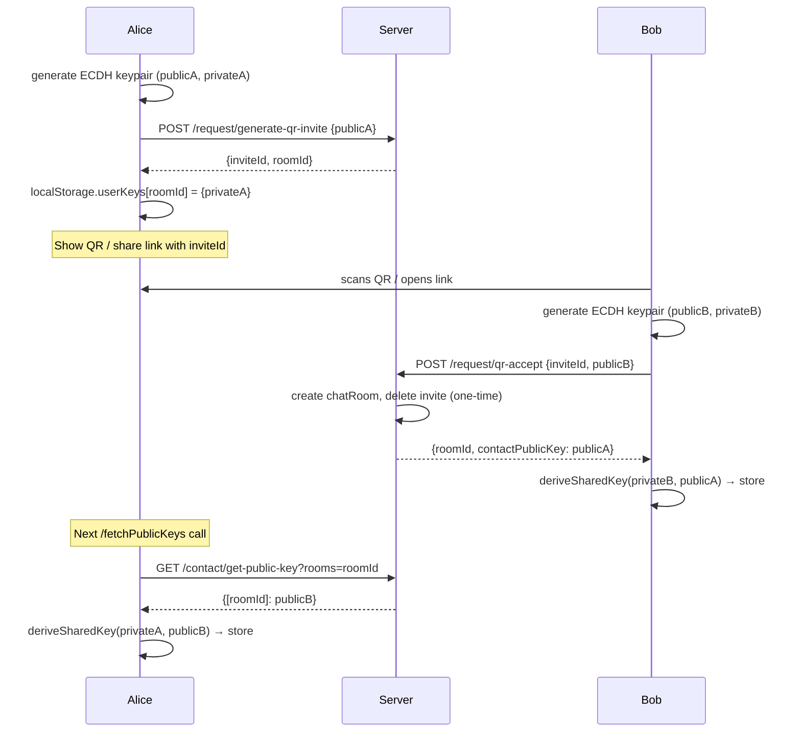

<div align="center">



# UKAchat

**A privacy-first, glassmorphic chat platform with end-to-end encryption, peer-to-peer calls, and QR-based invites.**

<br />


</div>

---

## About

UKAchat is an invite-only chat application engineered with strong privacy guarantees, modern glassmorphic aesthetics, and real-time communication at its core. Every conversation is end-to-end encrypted using ECDH key exchange, every friend connection is gated by an explicit invite (link or QR), and every message or call is routed through a Redis-backed, Socket.IO-powered low-latency transport layer.

> The design anticipated Apple's glassmorphic direction — translucent surfaces, blurred backdrops, subtle glass borders, and fluid reactivity — long before it became the industry trend.

---

## Screenshots

<div align="center">

<table>
<tr>
<td align="center" width="50%"><br /><sub><b>Login</b></sub></td>
<td align="center" width="50%"><br /><sub><b>Chat Window</b></sub></td>
</tr>
<tr>
<td align="center" width="50%"><br /><sub><b>Video Call</b></sub></td>
<td align="center" width="50%"><br /><sub><b>QR Invite</b></sub></td>
</tr>
</table>

</div>

---

## Features

### End-to-End Encryption
ECDH (P-384) key exchange per room, keys derive to AES-GCM 256-bit shared keys. Private keys never leave the client's `localStorage`. The server only ever sees public keys and ciphertext.

### Invite-Based Connections
No one can message you until you accept them. Every contact is created through an explicit invite — either by direct user ID, a shareable one-time link, or a scannable QR code.

### QR & Shareable Invite Links
Generate a one-time invite containing your fresh public key. The recipient derives the shared key automatically on claim. The link is consumed on first use.

### Server-Side Message Persistence
Messages live on the server in ciphertext form. Switch devices, lose local storage, re-login — your chat history is preserved but only you and your contact can decrypt it.

### WebRTC Voice & Video Calls
Peer-to-peer media streams (audio + video) with STUN-backed negotiation. Mic toggle, speaker toggle, camera toggle, hang-up controls — all stateful and per-call.

### Low-Latency Transport
Socket.IO handles bi-directional signalling. Redis caches online presence, room membership, and query results for sub-100ms response times even at scale.

### Glassmorphic UI
Backdrop-filter blur, translucent surfaces, layered shadows, square-rounded iconography. A design language built for depth and calm.

### Custom Wallpaper & Cycling
Upload a personal wallpaper (stored locally, never uploaded to the server), or cycle through a curated default set with a single click.

### Encryption Key Export / Import
Portable key backup — download your `userKeys` bundle as JSON and import it on another device to regain access to your chats.

---

## Architecture



### Message Flow



### Invite & Key Exchange



---

## Tech Stack

| Layer       | Technology |
|-------------|------------|
| Frontend    | React 18, Vite 5, SCSS, React Router 6 |
| Styling     | Glassmorphic SCSS, `react-parallax-tilt`, `qrcode.react` |
| Realtime    | Socket.IO (client + server) |
| Calls       | WebRTC (RTCPeerConnection), Google & Twilio STUN |
| Crypto      | Web Crypto API (ECDH P-384, AES-GCM 256) |
| Backend     | Node.js, Express, Mongoose ODM |
| Database    | MongoDB Atlas |
| Cache       | Redis (via `ioredis`) |
| Media       | Cloudinary |
| Auth        | JWT (`jsonwebtoken`), bcrypt-style hashing |
| Mail        | Nodemailer (verification + password reset) |

---

## Getting Started

All commands are run from the **project root**.

### Prerequisites

- **Node.js** `>= 18.x`
- **npm** `>= 9.x`
- **MongoDB** (local instance or Atlas cluster)
- **Redis** `>= 7.x` — **required**, must be running before the server starts
- **Cloudinary** account (free tier works)

> **Redis is mandatory.** The server uses Redis for online-presence tracking, room membership, and query caching. Without it, the backend will throw connection errors and API requests will hang.
>
> **Quick start options:**
> - **Docker (recommended):** `docker run -d --name ukachat-redis -p 6379:6379 redis:7-alpine`
> - **Windows:** install via [Memurai](https://www.memurai.com/) or WSL2 + `sudo apt install redis-server`
> - **macOS:** `brew install redis && brew services start redis`
> - **Linux:** `sudo apt install redis-server && sudo systemctl start redis`
> - **Full stack via compose:** skip local install, use `npm run docker` (brings up Redis automatically)
>
> Set `REDIS_HOST` in `server/.env` to `redis://localhost:6379` for local Redis, or `redis://redis:6379` when running via `docker-compose`.

### 1. Clone

```bash
git clone https://github.com/unnat1654/UKAchat.git
cd UKAchat
```

### 2. Environment Variables

Create `server/.env`:

```env
PORT=6970
DEV_MODE=DEVELOPMENT
DATABASE_URL=mongodb+srv://<user>:<pass>@<cluster>.mongodb.net/UKAchat
JWT_SECRET=<long-random-string>
HELPER_JWT_SECRET=<another-long-random-string>
REDIS_HOST=redis://localhost:6379
MAILER_EMAIL=<smtp-email>
MAILER_PASSWORD=<smtp-app-password>
```

Create `client/.env`:

```env
VITE_SERVER=http://localhost:8080/api/v0
```

> Cloudinary credentials currently live inline in `server/server.js`. Move them to env vars for production deployments.

### 3. Install Dependencies

```bash
npm run install-all      # installs both server/ and client/ deps
```

No root-level `node_modules` is created. The `dev` script reuses `concurrently` from the server's dependencies via `npm exec`.

### 4. Run in Development

```bash
npm run dev              # starts server + client concurrently
```

Or run them separately:

```bash
npm run server           # backend only  (http://localhost:8080)
npm run client           # frontend only (http://localhost:5173)
```

### 5. Build Client for Production

```bash
npm run build-client
```

### 6. Run with Docker

```bash
npm run docker           # wrapper for: docker-compose up --build
```

Brings up the app container plus a Redis container on the shared `app-network` bridge. The `docker-compose.yml` and `Dockerfile` both live so that `docker-compose` is invoked from the root.

---

## Root Scripts Reference

| Command | What it does |
|---------|--------------|
| `npm run install-all` | Install dependencies for both `server/` and `client/` |
| `npm run server`      | Start the backend with `nodemon` |
| `npm run client`      | Start the Vite dev server |
| `npm run dev`         | Run both concurrently |
| `npm start`           | Start backend in production mode (`node server.js`) |
| `npm run build-client`| Produce a static client bundle |
| `npm run docker`      | `docker-compose up --build` from the root |

---

## Project Structure

```
UKAchat/
├── client/                    # React + Vite frontend
│   ├── src/
│   │   ├── assets/            # Default wallpapers, icons, GIFs
│   │   │   └── wallpapers/
│   │   ├── components/        # UI components (chat, call, invite, logout-menu)
│   │   ├── context/           # React contexts (auth, socket, wallpaper, ...)
│   │   ├── functions/         # Crypto + localStorage helpers
│   │   ├── hooks/             # Custom hooks (caller, incoming-call, tab-details)
│   │   ├── pages/             # Routed pages (Home, Login, Signup, Invite, ...)
│   │   ├── services/          # peer.js (WebRTC singleton)
│   │   └── styles/            # Glassmorphic SCSS source
│   └── vite.config.js
│
├── server/                    # Node + Express backend
│   ├── config/                # DB, Redis, Socket.IO bootstrap
│   ├── controllers/           # Route handlers (auth, chat, contact, request, socket)
│   ├── helpers/               # Reusable logic (mail, cache, encryption, presence)
│   ├── middlewares/           # JWT auth middleware
│   ├── models/                # Mongoose schemas (user, room, request)
│   ├── routes/                # Express routers
│   ├── Dockerfile
│   └── server.js
│
├── docker-compose.yml         # orchestrates server + redis from the root
├── package.json               # root scripts (install-all, dev, docker, ...)
└── README.md
```

---

## Security Model

- **Private keys stay on the device.** They are generated in-browser via `window.crypto.subtle.generateKey`, stored only in `localStorage`, and never transmitted.
- **Public keys are exchanged** through the invite flow and cached on the server per room.
- **Shared keys are derived locally** on both sides using ECDH (P-384) and used as AES-GCM 256-bit keys for message encryption.
- **Messages are encrypted before leaving the browser.** The server stores and forwards ciphertext only.
- **Each message uses a fresh IV**, preventing key reuse attacks.
- **One-time invite tokens** self-destruct on first claim, preventing replay.
- **JWT-signed email links** are used for email verification and password reset flows.

---

## Key Shortcuts & UX Notes

- Click the **sidebar user icon** → opens the profile menu (change photo, manage keys, generate QR invite, upload wallpaper, logout).
- Click the **square glass icon** above your profile → cycles through default and custom wallpapers.
- Generate a **QR / invite link** from the profile menu — share it once; it expires on use.
- **Download your keys** from the profile menu to port your identity to another device.

---

## Author

**Unnat Kumar Agarwal**

---

## License

Distributed under the terms of the LICENSE file included in this repository.
